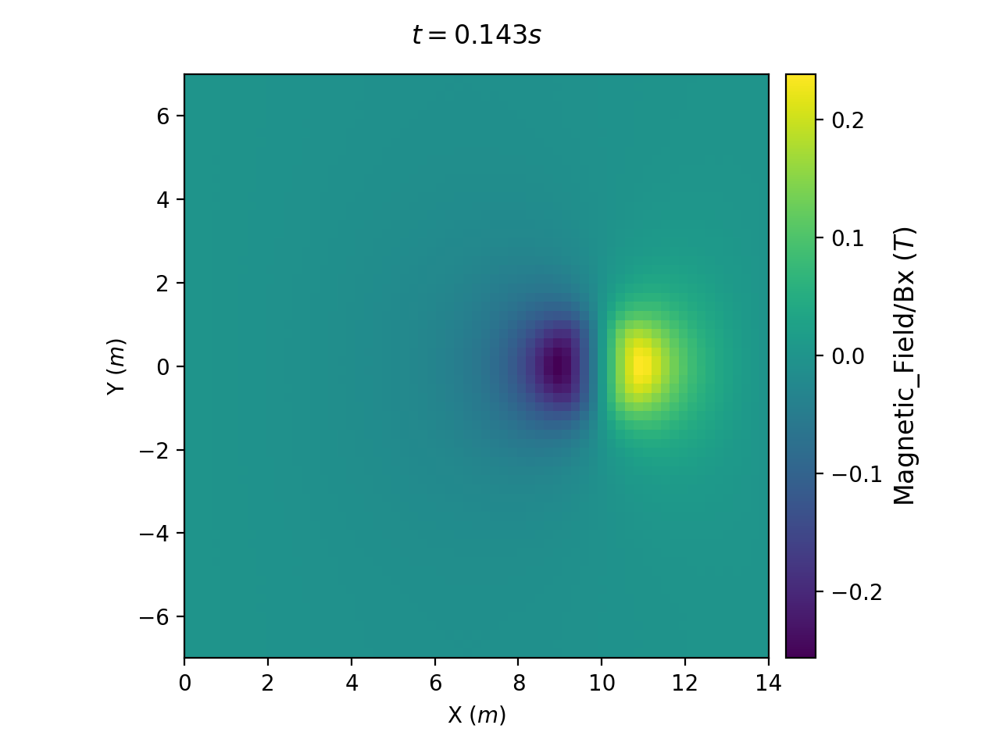

DOWNLOADING AND BUILDING THE CODE
---------------------------------

Within the LAre3d directory there are various subdirectories and a "Makefile"
containing the instructions for compiling the code.

Many people will be used to editing Makefiles by hand in order to set them up
for their own working environment. However, this is not the recommended way
of working with the Lare3d codebase. In theory, all the changes necessary for
compiling Lare3d on any given environment should be possible using command-line
variables.

For most setups, it should only be necessary to set the COMPILER variable to
correspond to the Fortran compiler to be used. This can either be set as an
option to the "make" command or as an environment variable.

For example, to compile the code using Intel's "ifort" Fortran compiler, you
can either type the following:
```
  $> make COMPILER=intel
```

or alternatively:
```
  $> export COMPILER=intel
  $> make
```

In these two examples `$>` represents the terminal's command-line prompt.
After compilation is complete, the binary file will be created in "bin/lare3d"

Since most people will always be using the same compiler on a specific machine,
it is often easiest to just add the line `export COMPILER=intel` to your shell
script initialisation file (ie. "$HOME/.bashrc" on most modern UNIX machines).

The actual compiler command used is the MPI fortran wrapper. On nearly all
machines, this is called "mpif90" and so this is what is used by default.
Occasionally, some machines will call it something different. For example,
Intel's MPI wrapper script is sometimes called "mpiifort". If your machine has
such a setup, you can set the name of the wrapper script using the variable
MPIF90. For example:
```
  $> make COMPILER=intel MPIF90=mpiifort
```

Again, it is often easiest to add the line `export MPIF90=mpiifort` to your
$HOME/.bashrc file.

Finally, there are two more variables which can be used to control the options
used when building the code.

Setting "MODE=debug" will build the code with optimisation disabled and
debugging flags turned on. If this variable is not set then the default is to
build a fully optimised version of the code.

There are several pre-processor flags which can be passed at compile-time to
change the behaviour of the code. These flags are described in the Makefile
with the lines beginning "#DEFINES += " and they are commented out by default.
Rather than uncommenting these lines, it is possible to set them on the
command-line using the "DEFINE" variable. For example, to compile a
single-precision version with Qmono viscosity you would type:
```
  $> make DEFINE="-DQMONO -DSINGLE"
```


COMPILING SDF AND THE VISIT READER
----------------------------------

The LareXd codes use a self-describing file format called SDF. The routines
used in reading and writing such files, along with reader plugins for Matlab,
IDL, python and VisIt are contained in the SDF directory.

The library used by Lare3d for reading and writing the files is automatically
built when you first build Lare3d. However, it is important to note that
whenever you rebuild Lare3d, the SDF library is NOT rebuilt by default. It is
also not removed when you type "make clean". Most of the time, this is what
you want since rebuilding the library adds a significant amount of time to
the compilation of the code. However, occasionally you might want to force the
library to be rebuilt, such as when you switch compilers. To accomplish this
you must first type "make cleanall" which will remove the existing library and
it will then get rebuilt next time you type "make".

In order to visualise data using the VisIt program, you must first build the
SDF VisIt reader plugin. As a pre-requisite, you must have the VisIt binary
in your shell's search path. You can check this by typing:
```
  $> visit -version
```
which should return with a message such as "The current version of VisIt is .."
If instead you get "visit: command not found" then you may need to edit your
PATH environment variable appropriately. Your system administrator should be
able to help.
Next you will need to ensure that you have a C++ compiler (preferably GNU g++)
and CMake. Again, you can check these using `g++ --version` and
`cmake -version`. Note that the appropriate version of these utilities may
depend on the version of VisIt that you have installed.

Once these pre-requisites have been met, you should be able to build the
reader plugin by typing `make visit`. You do not need to do this again unless
you upgrade your version of the VisIt utility. It is rare that any changes to
Lare3d will require an update of the VisIt reader, but if you do start to
encounter errors when reading SDF files then you can try rebuilding the reader
using the commands `make visitclean` followed by `make visit`.

Note that older versions of Lare3d used the CFD format. This is now obsolete
and current versions of the code no longer contain any reader plugin for this
format. However, existing installations of the VisIt CFD plugin will happily
co-exist with the SDF plugin and issuing `make visitclean` will not remove
such plugins.


WORKING WITH THE GIT REPOSITORY
-------------------------------

For more advanced users, the code is also hosted on a git repository. Details
can be found in the "Code" section on the GitHub site. There is quite a
steep learning curve for using git, so using this repository is only
recommended for more advanced users who are comfortable that they can deal with
a "git conflict".

One other added complication, is that the Lare3d repository also uses git
submodules for tracking the SDF file format. This adds an extra source of
possible issues. However, once a workflow is established it can all be quite
straightforward to work with.

To perform an initial checkout of the code using git, you should issue the
following command:

```
  git clone --recursive https://github.com/Warwick-Plasma/Lare3d.git
```

The "--recursive" flag ensures that not only the "lare3d"
repository is checked out, but also the "SDF" submodules. You will be prompted
for a username and password. You should enter the same username and password
that you use to login to your GitLab account.

It is recommended that after checking out a copy of the git repository, users
immediately create a new working branch and leave the default "main" branch
untouched. A new branch can be created and switched to with the command
`git checkout -b work`.

When you wish to update to the latest version, do the following sequence of
actions. First, commit or stash any changes you have made in your "work"
branch. Next, switch to the "main" branch with
`git checkout main`. Now pull the changes with `git pull`,
followed by `git submodule update --recursive`.
At this stage your "main" branch should be fully up to date.

Merging the new version in with your "work" branch is prone to error, so it
is recommended that you create a temporary copy of this branch just in case
everything goes wrong. The command "git branch workold work" will
create a branch named "workold" which is just a copy of "work". This branch
can be deleted once the merge is completed successfully. If everything goes
wrong in the "work" branch, you can reset it back to the original using the
command `git reset --hard workold`.

In order to update your work branch, switch back to it with
`git checkout work` and merge in the changes with `git merge main`.
After issuing this last command, there is a fair chance that you will encounter
conflicts. You must now resolve those conflicts and commit the changes.
After successfully merging in the changes, you can now delete the temporary
copy of your work branch with `git branch -D workold`.


# Installing the python SDF readers

To install the python SDF readers you need to have an installation of
python (2 or 3) with the numpy library. The automated plotting library
requires the matplotlib library. Both numpy and matplotlib are available
through most system package managers or are installable through
[pip](https://pip.pypa.io/en/stable/).

Once you have a working python install, just go to the root Lare3d
directory and type

`make sdfutils`

This will build the SDF python library and install the sdf_helper
wrapper and utility layer.

# Using the sdf_helper wrapper layer

The low level python SDF library is not user friendly, so a wrapper
layer called sdf_helper has been written. This wrapper layer simplifies
loading SDF files and provides simple plotting routines using
matplotlib.

### Importing sdf_helper

Importing sdf_helper is as simple as

```python
import sdf_helper
```

In these examples, the numpy and matplotlib libraries are usually loaded
too, and an alias is created for sdf_helper, so the boilerplate code
looks like

```python
import sdf_helper as sh
import numpy as np
import matplotlib.pyplot as plt
```

### Loading an SDF file using sdf_helper

To load a file, use the `getdata` function. This function takes either a
string which it loads as a filename, so to load the file `Data/0001.df`
you would run

```python
import sdf_helper as sh
data = sh.getdata('Data/0001.sdf')
```

or it takes a number which is the dump number, and optionally a second
parameter which is the directory name as a string, so you would run

```python
import sdf_helper as sh
data = sh.getdata(1, 'Data')
```

Because memory is only allocated when needed in the SDF python reader
there is no way of specifying which variables to load using getdata. All
variables are available when the file is first loaded, and memory is
allocated when the variable is first used.

### Listing the available variables in an SDF file

To see what variables are available use the list_variables method

```python
import sdf_helper as sh
data = sh.getdata('Data/0001.sdf')
sh.list_variables(data)
```

This produces an output that looks something like

```text
Reading file Data/0001.sdf
t() = time
p(64, 64, 64) = Pressure
rho(64, 64, 64) = Rho
vx(65, 65, 65) = Vx
vy(65, 65, 65) = Vy
vz(65, 65, 65) = Vz
bx(65, 64, 64) = Bx
by(64, 65, 64) = By
bz(64, 64, 65) = Bz
x(65, 65, 65) = grid
y(65, 65, 65) = grid
z(65, 65, 65) = grid
xc(64, 64, 64) = grid_mid
yc(64, 64, 64) = grid_mid
zc(64, 64, 64) = grid_mid
CPUs_Current_rank <class 'sdf.BlockPlainVariable'> [0, 0, 0]
CPUs_Original_rank <class 'sdf.BlockPlainVariable'> [1, 1, 1]
Fluid_Energy <class 'sdf.BlockPlainVariable'> [64, 64, 64]
Fluid_Pressure <class 'sdf.BlockPlainVariable'> [64, 64, 64]
Fluid_Rho <class 'sdf.BlockPlainVariable'> [64, 64, 64]
Fluid_Temperature <class 'sdf.BlockPlainVariable'> [64, 64, 64]
Grid_CPUs_Original_rank <class 'sdf.BlockPlainMesh'> [2, 2, 2]
Grid_CPUs_Original_rank_mid <class 'sdf.BlockPlainMesh'> [1, 1, 1]
Grid_Grid <class 'sdf.BlockPlainMesh'> [65, 65, 65]
Grid_Grid_mid <class 'sdf.BlockPlainMesh'> [64, 64, 64]
Grid_Grid_xface <class 'sdf.BlockPlainMesh'> [66, 65, 65]
Grid_Grid_xface_mid <class 'sdf.BlockPlainMesh'> [65, 64, 64]
Grid_Grid_yface <class 'sdf.BlockPlainMesh'> [65, 66, 65]
Grid_Grid_yface_mid <class 'sdf.BlockPlainMesh'> [64, 65, 64]
Grid_Grid_zface <class 'sdf.BlockPlainMesh'> [65, 65, 66]
Grid_Grid_zface_mid <class 'sdf.BlockPlainMesh'> [64, 64, 65]
Last_dump_time_requested <class 'sdf.BlockConstant'> [1]
Magnetic_Field_Bx <class 'sdf.BlockPlainVariable'> [65, 64, 64]
Magnetic_Field_Bx_centred <class 'sdf.BlockPlainVariable'> [64, 64, 64]
Magnetic_Field_By <class 'sdf.BlockPlainVariable'> [64, 65, 64]
Magnetic_Field_By_centred <class 'sdf.BlockPlainVariable'> [64, 64, 64]
Magnetic_Field_Bz <class 'sdf.BlockPlainVariable'> [64, 64, 65]
Magnetic_Field_Bz_centred <class 'sdf.BlockPlainVariable'> [64, 64, 64]
Surface_Values_boundary_CPUs_Current_rank <class 'sdf.BlockPlainVariable'> [0, 0, 0]
...
```

These are the names of the variables in the data structure. This example
is taken from the default setup.

### Working with the data in an SDF file

You can access the underlying data using the names obtained from
`list_variables`

```python
variable = data.Magnetic_Field_Bx
```

This returns an instance of `sdf.BlockPlainVariable`. The raw contents of the
variable is a numpy array. It is then available using the `data` element
of these objects.

```python
import numpy as np
variable = data.Magnetic_Field_Bx
raw = variable.data
print(type(raw))
print(np.mean(raw))
```

produces the output

```text
<class 'numpy.ndarray'>
-0.003142203888931257
```

### Plotting using sdf_helper

The sdf_helper wrapper script comes with some plotting routines. They
are incomplete currently, but aim to provide as close as possible to
press ready figures in a single command. You need the `matplotlib`
library to use these routines. To plot data, simply provide an
`sdf.BlockPlainVariable` object to the routine `plot_auto`. An example
of plotting a 2D slice through a 3D variable, using the default setup to
generate the figures would be

```python
import sdf_helper as sh
import matplotlib.pyplot as plt

plt.ion()
data=sh.getdata('Data/0001.sdf')
sh.plot_auto(data.Magnetic_Field_Bx, iz=2)
```
Here, the parameter `iz=2` specifies that the plot should be an x-y slice
at the z-index of 2.
This will produce a window similar to the image shown here, with slight
difference depending on your version of matplotlib and your operating
system. The code `plt.ion()` sets matplotlib to interactive mode, so
control will be returned to you as soon as the plot has finished
drawing.


